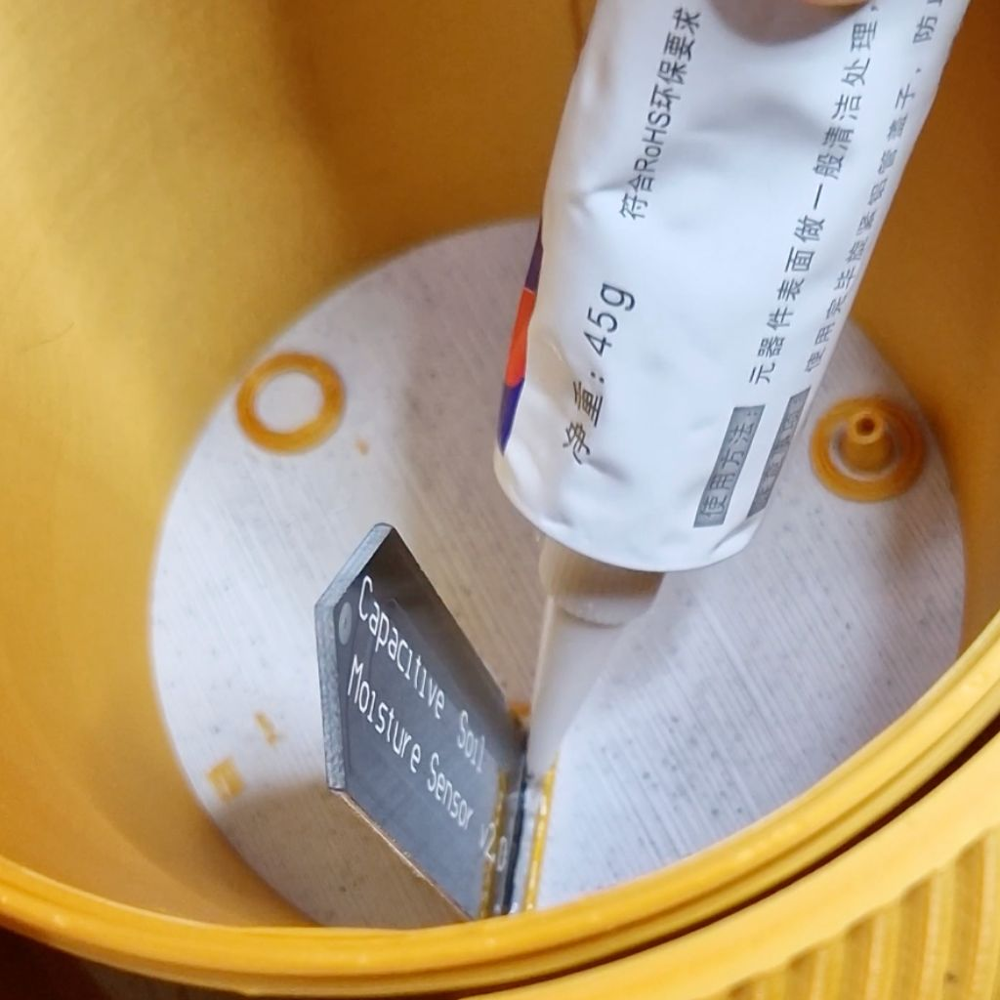
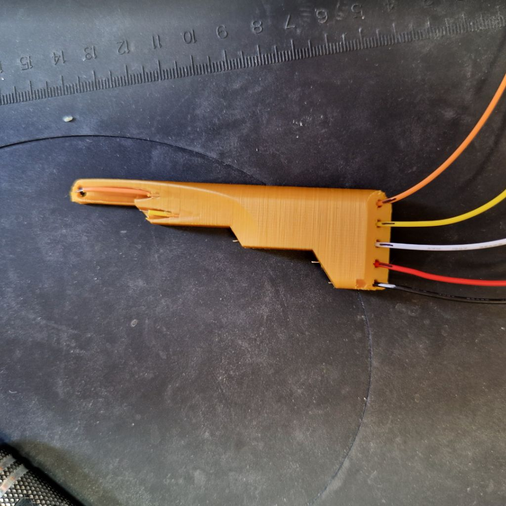
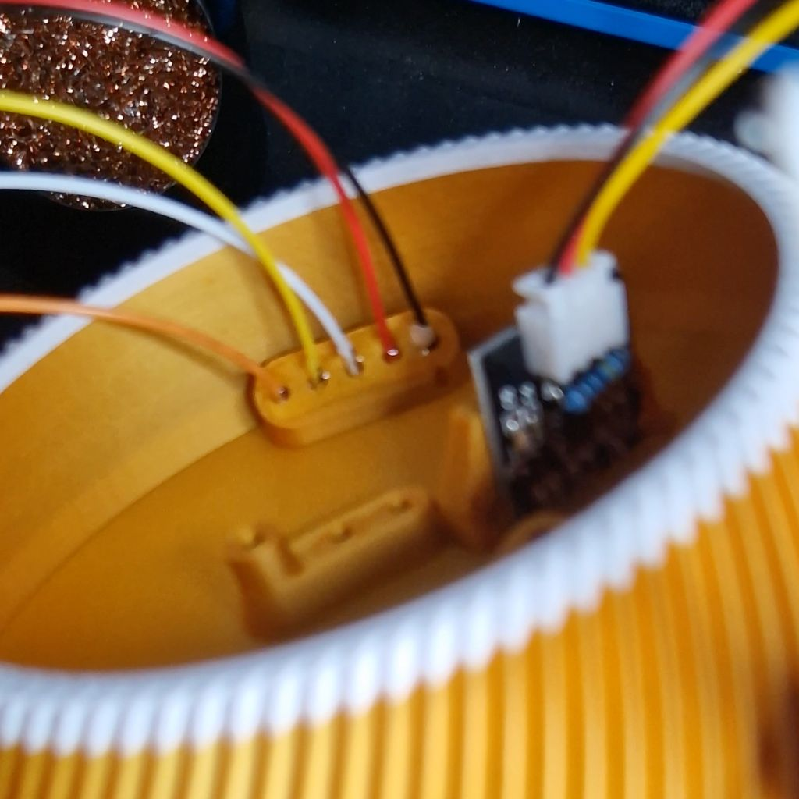
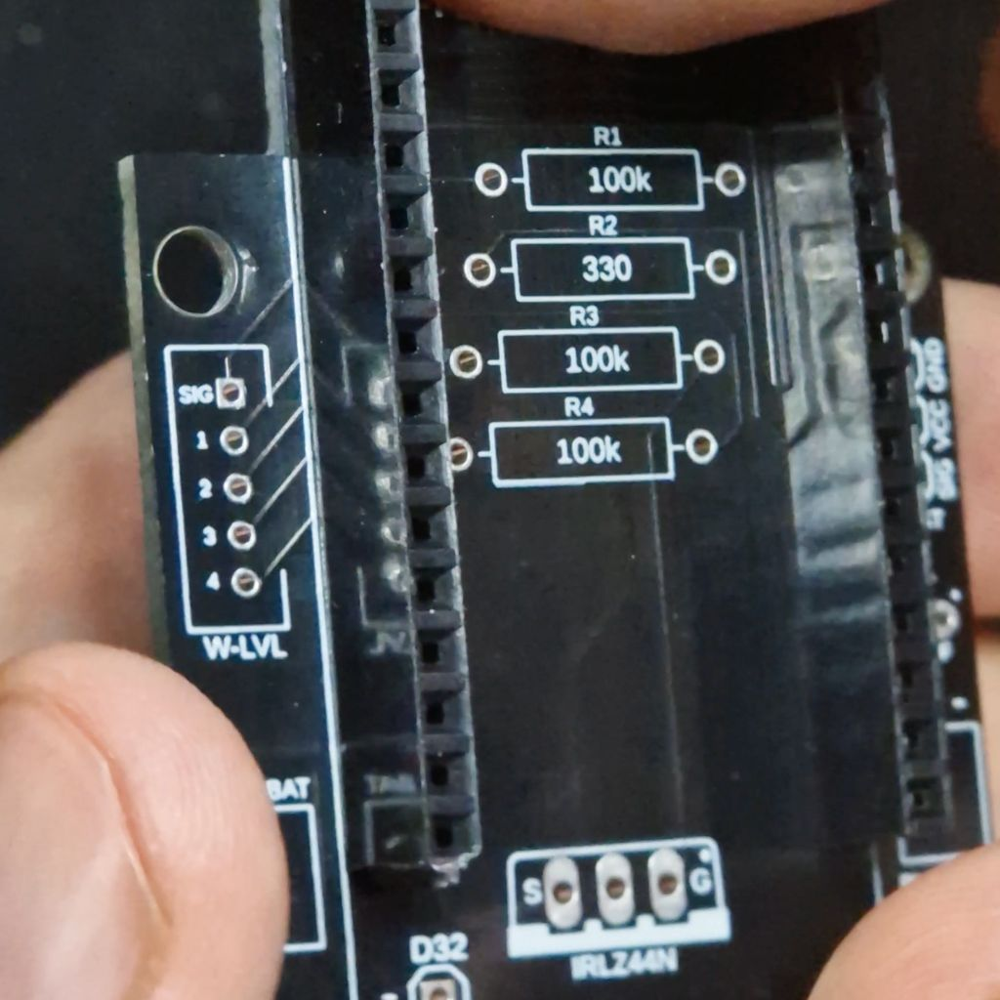
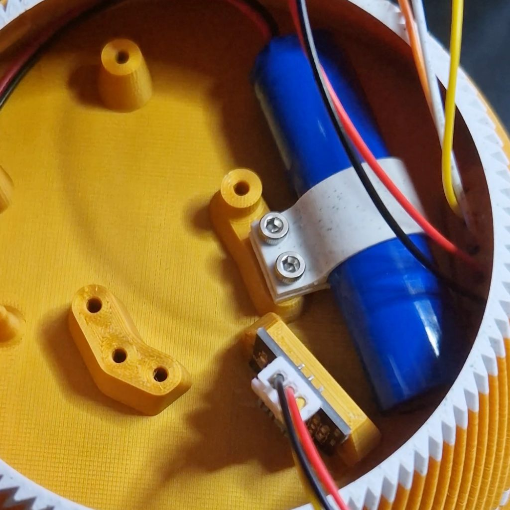
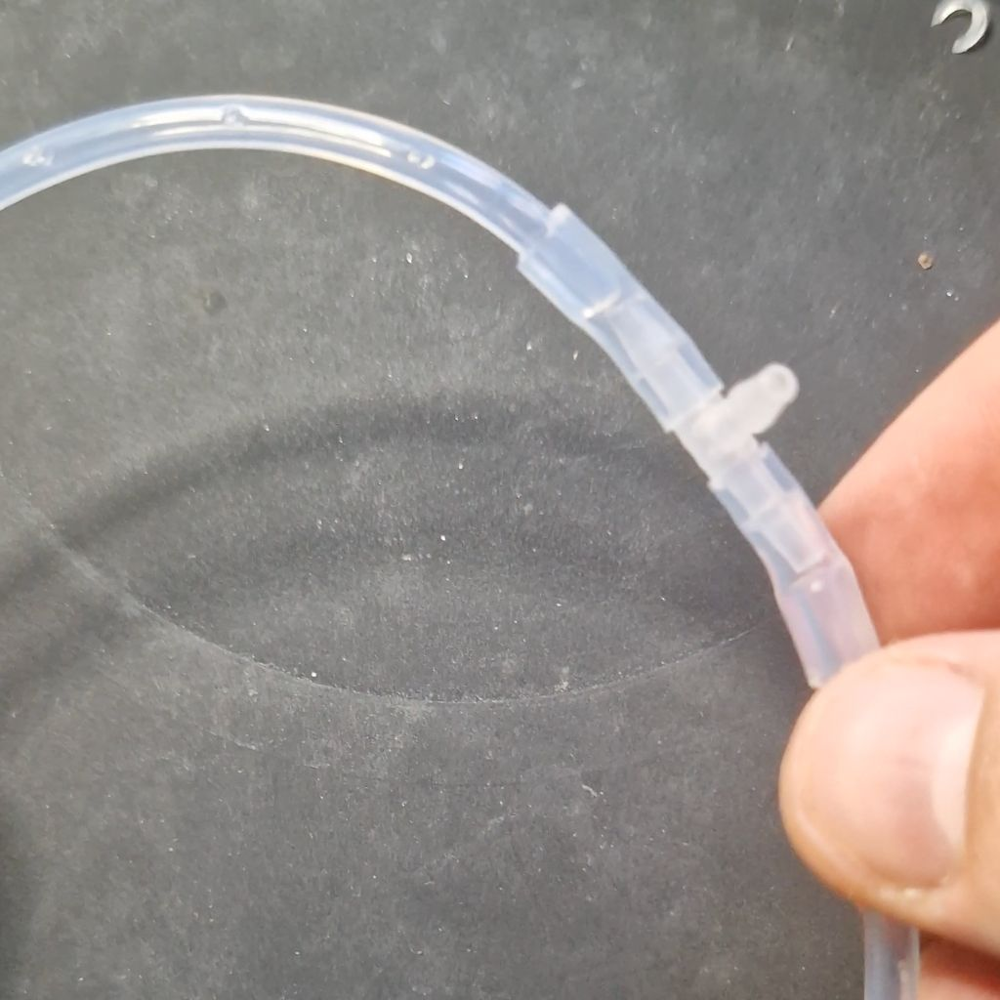
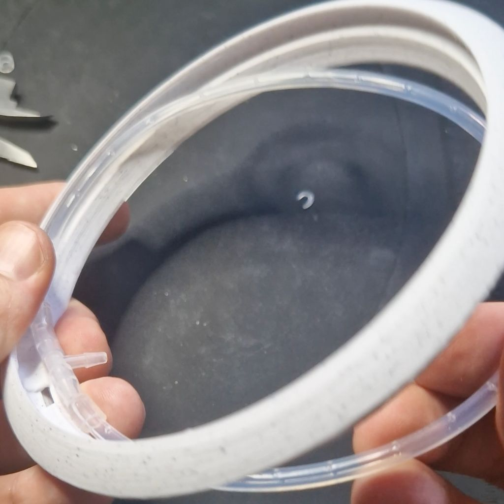

# Plantidote - A smart flower pot, self-watering

Plantidote, the antidote to never worry about failing your plants again.

## History of the project
Plantidote is based on [this awesome idea](https://github.com/FlauraPlantPot/Flaura) by Martin McMaker.
Unfortunately, it was working only with Blynk and the pot was difficult to make waterproof.

I completely redesigned the PCB and some parts of 3D models.
It is now easier to seal, requiring only 2 seal points. Hot glue or silicone sealant can be used. Thanks to Martin Vinter for [the inspiration](https://github.com/MartinVinter/Flaura2)

This new smart pot works with HomeAssistant/ESPHome, no need for Blynk. Home Assistant code is derived from MathGaming [modified version of Flaura](https://github.com/mathgaming/FlauraHomeAssistant).  Many thanks to him.

Plantidote has 4 design variations for the external shell and can be printed in different colors (shell & top lid).

| Round | Knurl | Spin | V Shape |
| --- | --- | --- | --- |
|  |  |  |  |

The vase can be autonomous for months thanks to its 0.5L water tank and its battery. The volume of the flower pot is 0.8L.


## How to build your own

### BOM

##### Hoses
| Name | Type | Diameter | Length | Link |
| --- | --- | --- | --- | --- |
| Hose - Watering ring  | PTFE | Ø4-Ø2mm | 365mm | [AliExpress](https://www.aliexpress.com/item/1005001976975889.html) |
| Hose - Ring/T | Silicone | Ø5-Ø3mm | 90mm | [AliExpress](https://www.aliexpress.com/item/1005002185082384.html) |
| Hose - "bridge" T-connector/Pot | Silicone | Ø5-Ø3mm | 2 x 15mm | [AliExpress](https://www.aliexpress.com/item/1005002185082384.html) |
| Hose - Pump | Silicone | Ø5-Ø3mm | 40mm + 50mm | [AliExpress](https://www.aliexpress.com/item/1005002185082384.html) |
| T-connector |  | Ø3.2-Ø2.4mm |  | [AliExpress](https://www.aliexpress.com/item/1005004196182380.html) |

PVC hose could work as well, but I advise silicone instead because it is softer and will prevent you from breaking the 3D printed hose connectors.

##### Electronics
| Quantity | Name | Specs | Note | Link |
| --- | --- | --- | --- | --- |
| 1 | Lolin D32 |  |  | [AliExpress](https://www.aliexpress.com/item/32808551116.html) |
| 1 | Diaphragm water pump | DC 3.7V | 2 visible diaphragms -> suitable for water | [AliExpress](https://www.aliexpress.com/item/4000974989453.html) |
| 3 | Resistor | 100kΩ |  | [AliExpress](https://www.aliexpress.com/item/32636020144.html) |
| 1 | Resistor | 330Ω |  | [AliExpress](https://www.aliexpress.com/item/32636020144.html) |
| 1 | Ceramic capacitor | 100nF |  | [AliExpress](https://www.aliexpress.com/item/1005003563792431.html) |
| 1 | Diode 1N4007 | 1A |  | [AliExpress](https://www.aliexpress.com/item/32633071171.html) |
| 1 | MOSFET IR**L**Z44N | Logic level | Don't confuse with : IR**F**Z44N | [AliExpress](https://www.aliexpress.com/item/32714396199.html) |
| 1 | Push button | 6x6x4.3mm |  | [AliExpress](https://www.aliexpress.com/item/4001223843274.html) |
| 1 | Power switch | SK12D07VG6 (6mm) |  | [AliExpress](https://www.aliexpress.com/item/1005003663462833.html) |
| 2 | Pin Header Female 16 Pins |  | PCB/LolinD32 connectors | [AliExpress](https://www.aliexpress.com/item/33004522737.html) |
| 1 | Pin Header Male 3 Pins |  | PCB/Moisture sensor connectors | [AliExpress](https://www.aliexpress.com/item/32758380907.html) |
| 2 | JST Connector Male/Female 2 Pins | PH Pitch 2.0 | Pump & battery connectors | [AliExpress](https://www.aliexpress.com/item/33009614944.html) 
| 1 | JST Connector Male/Female 5 Pins + cables  | PH Pitch 2.0 |  | [AliExpress](https://www.aliexpress.com/item/1005001782972538.html) |

| 1 | 18650 Li-Ion Battery Cylindrical 2200mAh 3.7V **with JST Connector** | 3.7V, > 2000 mAh, Protection circuitry included | I strongly discourage to buy cheap batteries on AliExpress, buy good batteries = safer and less issues | [AdaFruit](https://www.adafruit.com/product/1781) |
| 1 | Capacitive Soil Moisture Sensor |  | I strongly encourage you to watch [this video](https://www.youtube.com/watch?v=IGP38bz-K48) to avoid sensor issues | [AliExpress](https://www.aliexpress.com/item/32832538686.html) |
| 1 | Type-C Adapter USB C to Micro USB |  | Optional | [AliExpress](https://www.aliexpress.com/item/33035034558.html) |

##### Others
| Quantity | Name | Specs | Note | Link |
| --- | --- | --- | --- | --- |
| 4 | M3x6 screw |  | PCB screws | [AliExpress](https://www.aliexpress.com/item/1005005469135111.html) |
| 4 | M3x8 screw |  | Pump and battery screws | [AliExpress](https://www.aliexpress.com/item/1005005469135111.html) |
| 1 | Silicone rubber glue sealant |  | | [AliExpress](https://www.aliexpress.com/item/1005002041941459.html) |

##### PCB
The easiest way would be to order the custom PCB via this affiliated link. (coming soon)
Alternatively, you can use the gerber files in this repo and send them to your manufacturer of choice.

| 2D | Schematics |
| --- | --- |
|  |  |

##### 3D printing
Choose one of the shell variations. Print time is indicated below.

| Round: 1j13h | Knurl: 3j5h | Spin: 3j5h | V Shape: 3j3h |
| --- | --- | --- | --- |
|  |  |  |  |

Mandatory print parts:

- shell of your choice
- top lid
- inner planter
- battery holder
- pump holder
- sensor holder

Optional print parts:

- water sensor cable tester -> will help you determine the length of the cable needed
- sensor protector -> will help you protect the roots of the plants when filling the inner planter

**Print settings**
You can print in PLA or PETG, both worked fine for me.

The simplest way is to use the .3mf file and print them directly with PrusaSlicer, it's already all configured.

In case you need to set the settings yourself for the shells, here they are:

- print on it's head
- 0.15mm layer with 0.4mm nozzle
- layers & perimeters
	- vertical shells > perimeters: 7
	- horizontal shell > solid layers > top: 15
	- enable external perimeters first
	- seam: rear
- infill
	- density: 90%
	- bridging angle: 55
- supports
	- support style: snug
	- bottom contaxt Z distance: 0.1
	- bottom interface layer: 1
- speed
	- bridges: 15mm/s
	- first layer: 15mm/s
- custom range 4-13mm
	- speed > bridge: 8mm/s

###  Instructions 

##### Build instructions

###### Making the shell water resistant

**1.** place the moisture sensor in its hole. **IMPORTANT**: if you haven't watched [that video about fixing moisture sensors issues](https://www.youtube.com/watch?v=IGP38bz-K48) yet, now is the time before you proceed with sealing the moisture sensor
<br />**2.** secure the moisture sensor with the sensor holder
<br />**3.** seal it with the silicone glue on the inner part
<br />**4.** seal it with the silicone glue on the bottom part

| 1 | 2 | 3 | 4 |
| --- | --- | --- | --- |
|  |  |  |  |

<br />**5.** optional: apply silicone in the inner part of the vase as shown by the red circle. I'ts optional because it will depend on your print and filament quality.
<br />**6.** use the 5 pins cable and insert them into the "water sensor cable tester" as shown on the picture. Then mark the limit with a pen
<br />**7.** insert those 5 pins cable into the vase until you reach the mark (ground is indicated by a small cut next to the hole)
<br />**8.** seal it with the silicone glue
<br />**9.** **wait 48h** for it to dry
<br />**10.** put a silicone hose between the 2 bottom connectors and pour water into the tank to test for leakage (if needed, fix them with silicone glue)

| 5 | 6 | 7 |
| --- | --- | --- |
|  |  |  |

###### Soldering
It should not be hard to know what goes where since it is very well indicated on the PCB.<br />
<br />**1.** everything has to be soldered from the back of the PCB
<br />**2.** solder the 16 pins male to the PCB
<br />**3.** solder the 4 resistors and the ceramic capacitor

| 1 | 2 | 3 |
| --- | --- | --- |
|  |  |  |

<br />**4.** solder the diode and the MOSFET, **be very careful, the left/right side of these components matters**
<br />**5.** solder JST connectors for the pump and the battery, **be very careful, there is no standard on JST connectors**, the pins could be inverted for your connectors. Check that your red cable for the pump is on the "+" side of the board and black cable on the "-". Do the same for the battery connector. **Failure to check that could destroy your compotents**.
<br />**6.** solder the button and the power switch 

| 4 | 5 | 6 |
| --- | --- | --- |
|  |  |  |


<br />**7.** solder the 3 pins moisture sensor and the 5 pins connector (on the picture, you can see I use 5 cables intead of a 5 pins connectors but it is exactly the same)
<br />**8.** solder 1 cable with JST connector to the battery pins on the PCB 
<br />**9.** attach the LolinD32 to the PCB and plug the battery cable

| 7 | 8 | 9 |
| --- | --- | --- |
|  |  |  |

###### Assembling the bottom part 

**1.** install the battery + holder using two M3x8 screws
<br />**2.** cut 40mm and 50mm from the Ø5-Ø3mm hose, connect them to the pump and the hose connectors. If you bought the exact same pump as I did, the bigger connector on the pump is pushing out water, connect this one to the inner connector.
<br />**3.** install the pump + holder using two M3x8 screws
<br />**4.** install the PCB with two M3x6 screws

| 1 | 2 | 3 | 4 |
| --- | --- | --- | --- |
|  |  |  |  |
	
<br />**5.** plug all cables to their to their connectors
<br />**6.** plug the USB C adapter

| 5 | 6 |
| --- | --- |
|  |  |


###### Assembling the top part

**1.** cut 15mm from the Ø5-Ø3mm hose **twice**
<br />**2.** connect them to the T-connector
<br />**3.** cut 365mm of the the Ø4-Ø2mm hose
<br />**4.** connect it with the T-connector

| 1 | 2 | 3 | 4 |
| --- | --- | --- | --- |
|  |  |  |  |

<br />**5.** put the ring into the lid
<br />**6.** use a sharp tool to create small watering holes
<br />**7.** place the lid onto the vase, it should easily fit in and out
<br />**8.** cut 90mm from the the Ø5-Ø3mm hose and connect it to the bottom of the pot and the T-connector

| 5 | 6 | 7 | 8 |
| --- | --- | --- | --- |
|  |  |  |  |

<br />**9.** place the sensor protector on the inner planter (it will protect the roots of the plant when you insert it into the vase)
<br />**10.** put your plant into the inner planter
<br />**11.** put the planter into the vase and remove the sensor protector and voilà!

| 9 | 10 | 11 |
| --- | --- | --- |
|  |  |  |

##### Home Assistant & ESPHome instructions

###### ESPHome only
If you only want to have an autonomous smart plant, you can just upload the ESPHome code to the LolinD32 board by plugging it to your computer. To do that, you need to go to [ESPHome Web](https://web.esphome.io/) and upload the esphome-plantidote.yaml file.

###### HomeAssistant & ESPHome
If you want to be able to manually control and monitor your plant, you will need to have a Home Assitant server. For that, [go here](https://www.home-assistant.io/getting-started/).

Once Home Assitant setup, you need to create an ESPHome instance:

- plug your LolinD32 Board to your computer
- go to ESPHome tab on Home Assistant
- click New Device
- whem prompted, choose USB and follow the setup
- once this is finished, click on the top right "secrets" and add the following:

```
wifi_ssid: "yourWifiSsid"
wifi_password: "yourWifiPassword"
ota_password: "otaPasswordYouWant"
```

- click save
- then click Edit to edit yhe code, make sure to copy the api encryption key that is showing up, you will reuse it soon.
- replace the whole content of  the file with the content of esphome-plantidote.yaml and make sure to replace <encryption_key_here> with your key
- click save and install to upload it to the LolinD32 board, do it via USB again.
- once this is done, HA should give you a notification of a new device and you can add it to your integrations.

However, if not detected, you can manually setup a static IP
- edit your entity again and uncomment lines 61 to 64, configure it according to your router
- save and install via USB again.
- go to Home Assistant integrations (Settings > Devices and services), manually add a new integration.
- select ESPHome.
- use your newly set static IP for host, leave the port 6053 as default
- click next, then you will be prompted with the api encryption from earlier

You're all set, you can now configure the dashboard as you like.
See yaml widget files in esphome folder for widget examples.

### Design choices

Most of the component choices were based on the original project.
But I made some changes/improvements.

##### Resistors
R1, R3 and R4 are just pulldown resistors, so I chose 100kΩ.

R2 is to limit the current drawn by the MOSFET through the GPIO pins.
Lolin D32 max current per GPIO: 12mA
```R = U/Imax = 3.3/0.012 = 275Ω```
So R2 should at least be 275Ω, I chose R2 330Ω. 


##### Pins used
| GPIO | Function |
| --- | --- |
| 5  | Built-in LED |
| 13 | Wakeup deep sleep |
| 19 | Power soil moisture sensor |
| 17 | Power pump |
| 27 | Power water level sensor 100% |
| 26 | Power water level sensor 75% |
| 25 | Power water level sensor 50% |
| 33 | Power water level sensor 25% |
| 32 | Water level sensor signal |
| 34 | Soil moisture sensor signal |
| 35 | Battery voltage |

I avoided the use of strapping pins, on ESP32 they are: 0, 2, 4, 12, 15


### Some Fusion 360 PCB tips

##### To edit a single component footprint:

- Go on Schematics
- Find component in "Place component" left panel > right click > Edit library
- Find the footprint and double click will open the footprint editor
- Edit as you need and save
- Go back to schematic, right click the schematic component you wanted to update > replace
- A window opens, click on Open library to enable your custom library
- Find your component in the list

This should update the footprint in the PCB editor

##### To check errors before export:

- In schematics > Validate > Errors > Check everything OK then sync
- In PCB editor > Rules DRC/ERC > DRC > Check everything OK

##### To export PCB manufacturing files:

- In PCB editor > Manufacturing > CAM processor > CAM
- In output files tab > Gerber > Profile > Add layer > 46 milling
- Process job
- Send files in "DrillFiles" and "GerberFiles" to manufacturer


